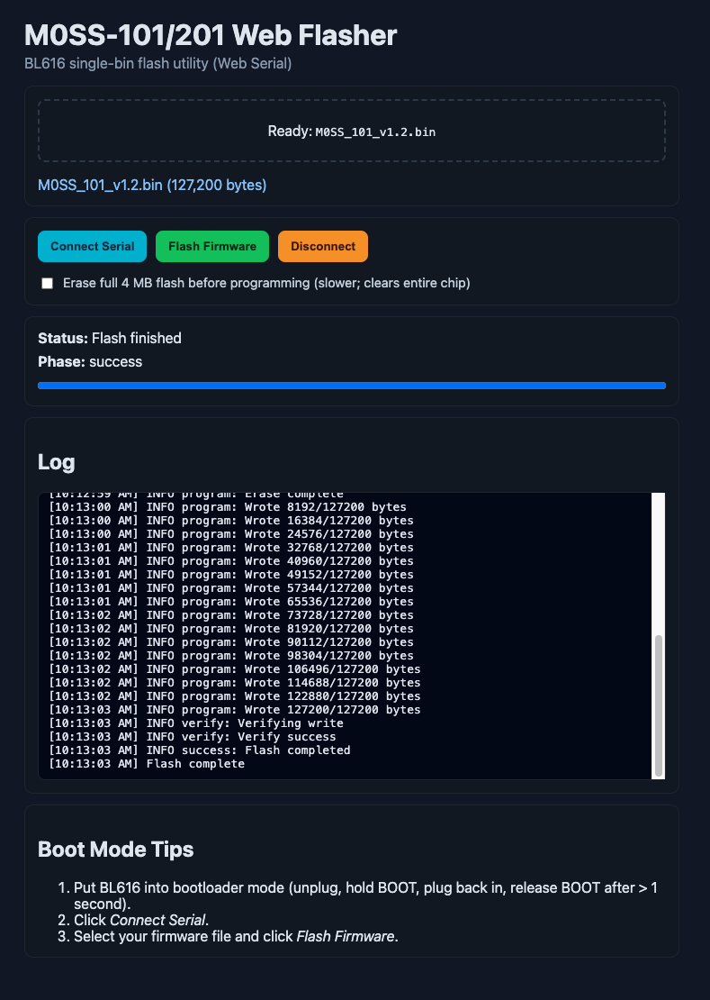

# M0SS-101/201 Web Flasher (BL616)

Browser-based BL616 flasher for M0SS-101/201 firmware using Web Serial.

## Current status

The flasher is now validated on BL616 (`JEDEC c86016`) with end-to-end success, including full write + SHA verify, using a hardened recovery path for intermittent UART/CDC stalls and a buffered serial read transport.

### Implemented flow

- Vanilla HTML/CSS/JS app (no build step)
- Single `.bin` firmware selection (drag/drop or browse)
- Web Serial connect/disconnect and session logging
- BL616 flashing protocol aligned with `bflb-mcu-tool` framing:
  - boot sync / handshake
  - `get_boot_info` (`0x10`)
  - `set_timeout` (`0x23`)
  - `flash_set_para` (`0x3b`)
  - `flash_read_jedec_id` (`0x36`)
  - `flash_erase` (`0x30`)
  - `flash_write` (`0x31`) + `flash_write_check` (`0x3a`)
  - SHA verify via XIP read mode (`0x60` / `0x3e` / `0x61`)

## Stability profile (default)

`bl616-flasher.js` currently uses a tuned reliability profile:

- `CHUNK_SIZE = 64`
- `MIN_CHUNK_SIZE = 32`
- `MAX_FLASH_WRITE_CHUNK = 256`
- Write ACK/retry policy:
  - normal chunks: `8000ms`, `3` retries
  - `<= 64` bytes: `2500ms`, `2` retries
  - `<= 32` bytes: `3000ms`, `2` retries
- Adaptive write fallback:
  - reduce chunk size on instability
  - increase inter-chunk delay on timeouts when stale bytes are drained
- Strict recovery sequence on persistent min-chunk timeout:
  - handshake
  - boot info read
  - bootrom timeout set
  - drain stale bytes
- Recovery guardrail:
  - base cap `8` attempts
  - cap can grow (up to `20`) only if each recovery is making forward offset progress

This prevents infinite loops while allowing long flashes that recover intermittently.

`serial.js` / `app.js` transport defaults:

- Default connect baud: `921600`
- Web Serial port open buffer: `16384`
- Read path uses a background pump + buffered waiters (single reader, no overlapping `reader.read()` calls)

## Known behavior

- Intermittent `flash_write` stalls can still occur on Web Serial at higher throughput settings.
- Recovery is expected and logged; successful recovery continues from the same offset.
- `serial.js` now uses a background read pump + internal buffering to avoid overlapping `reader.read()` races.
- Throughput tuning should be validated per board/cable/host; higher baud and larger chunks can increase retry frequency.
- If recovery exhausts its attempt budget, user action is required: re-enter BOOT mode and retry.

## Run locally

Serve this directory with any static file server and open it in a Chromium-based browser, for example:

- `python3 -m http.server 8080`
- Open `http://localhost:8080`

## Use

1. Load a `.bin` file.
1. Put board into bootloader mode (unplug, hold BOOT, plug back in, release BOOT after > 1 second).
1. Click **Connect Serial** and choose the BL616 serial device.
1. Select your firmware file and click **Flash Firmware**.
1. Wait for `Verify success` and `Flash completed`.

## Project files

- `index.html` UI layout
- `styles.css` styles
- `app.js` UI/controller logic
- `serial.js` Web Serial transport abstraction
- `bl616-flasher.js` BL616 flashing state machine and recovery logic
